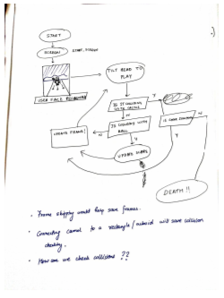
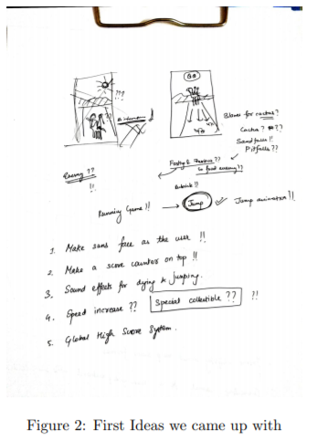
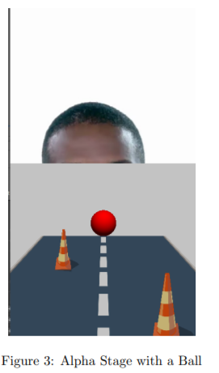
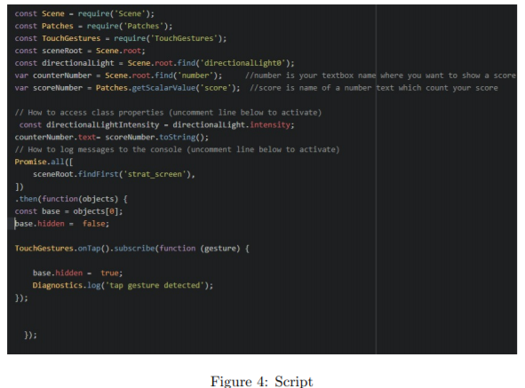
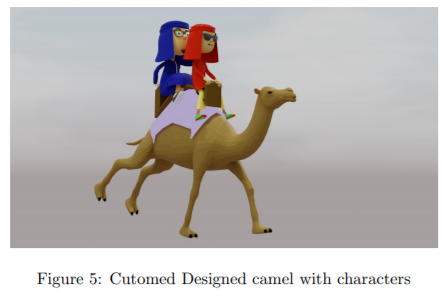
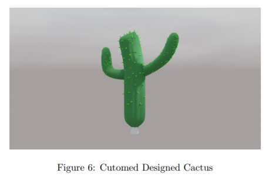
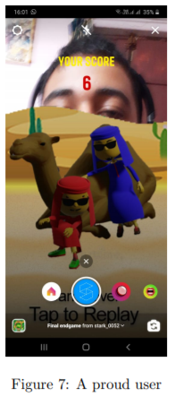

# Capstone Project

 Team Sad Boiz (Subham Kumar Singh and Naksatra Bailung)
 18-06-2020

## 1 Game Idea

### 1.1 The Problem Statement

Since we had selected the entertainment section and were acquainted with
Jordindian and their Youtube channel in the process. We decided to go with
our favorite Jordindian song”Smoke shisha Play fifa”as the theme of our game.

## 2 Wireframing

### 2.1 Deciding the concept of the game

We approached a frontal based running approach since interaction of the model
from the back would give a similar feel to all the mobile running games we have
played. The controls would be suffered and the user would be new to this type
of gaming but the user can clearly view the faces of the model which would be
a better approach.

### 2.2 How will it work?

Many of ideas we had were scraped since most of them required either scripting
and sometimes the SparkAR studio would not be able to handle multiple inputs.

Figure 1: Game Logic Idea

Figure 2: First Ideas we came up with

## 3 Alpha Stages

We tested for a balls collision in the alpha stages which we got pretty good
feedback for with almost 32 fps on the simple game. We also put in the jump
animation for testing with this alpha stage. It was well received by many alpha
tester we had handed over to.

### 3.1 What we are leaving out?

- Sun as the user’s face: It would take up more than 50% as non intractable
    part which would violate the Instagram filer guidelines.
- Sound effects for dying and jumping: Layering multiple audio files with
    logic produces a lag in the patch editor.
- Speed increase: We decided to scrape off the idea since there were no
    available method for a script to understand frame skipping since asyn-
    chronous programming will experience delay depending upon the amount
    of processes it has to do with SparkAR’s own visual updating.
- Uploading High Scores: We needed to have a backend to obtain scores.
    It can be achieved with a simple free server with NodeJS but we decided

Figure 3: Alpha Stage with a Ball

to skip on it due to time constraints. This might also invade the users
privacy even further.

- Jump animation: We decided to skip it since the frame rate would drop
    even further and the gameplay mechanics were set already.

### 3.2 What we can suggest to future developers?

- Developing a standard game logic without scripting is extremely hard in
    SparkAR.
- There is no help with documentation regarding SparkAR since it just uses
    JavaScript. Most of the tutorials on scripting are bare minimum or just
    lists out the variables which can be exported with each frame in SparkAR
- Patch exporter easily crashes on layer changes of objects.
- Making a 2d game while using 3d assets really took a toll on our game.
    Try to use 2d assets as much as possible.

## 4 Game Logic

The following section contains the technical description of the capstone project
(i.e Patches, Assets, Scripts) used in order to complete this capstone project
The entire Capstone project is made with 95 percent of patches and 5 percent
with the script.

### 4.1 Patches

Logic:

- And
- Or
- Not
- Equal
- Equal or less
- Greater than

Interaction:

- Screen Tap
- Face Tracker movement
- Object Tap

Utility:

- Switch
- Pulse
- Value
- Counter
- Pack
- Unpack
- Random
- Clamp

Animation:

- Loop Animation
- Animation
- Transition

### 4.2 Script

Script is used Mainly for start screen and score update.

Figure 4: Script

### 4.3 Assests

We Designed Customed model for this effect.

4.3.1 3d Models

- Camel : The camel was imported using cgtrader
- Cactus : A handmade model using blender
- Football : A handmade football and a picture
- Background :
- Desert track : A handmade model using blender
- Naser and Vineeth : We used the models provided to us in our starter kit.

4.3.2 Audio Files

- Starting music: It was made from the last part of the ”Smoke Shisha Play
    Fifa” song.

Figure 5: Cutomed Designed camel with characters

Figure 6: Cutomed Designed Cactus

## 5 Reactions and Future

### 5.1 What the user feels?

Most of the users had great responses but everyone felt that controls are a bit
weird and the object collision does not work properly. This is the issue with
the patch editor which we never addressed as it was a part of the game and
the slow pace was simple to control. A user suggested addition of a counter

meter before the start of the game but we also discarded it. One of our alpha
testers recommended we increase the play screen area so that they could relate
with their nose as the character’s position which we did implement on the final
product.

Figure 7: A proud user

## 6 What we look towards for this in the future?

We would like to implement all of the ideas we had left. In addition to that we
may add in a counter meter before the start of the game. We would also like to
add in an extra collectible such as an oil barrel which can convert the camel into
a car just for 3 seconds and which runs at faster speeds while the user collects
the footballs. We would also like to add in a story section to the game and
hidden collectibles which you can access after obtaining some achievements. A
minimap of the next row of cactus on the bottom left would be really good for
people to plan out their strategies or get ready to tilt their head in a particular
direction.

